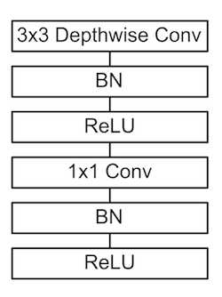

# CS348K Assignment 2: Efficient MobileNet Conv Layer Evaluation #

In this assignment you will implement a layer of a CNN. In particular, this assignment is restricted to the evaluation of a single convolutional layer of the network. See https://arxiv.org/abs/1704.04861 for more details about the full network. Also, unlike the camera RAW assignment, this assignemnt is focused on efficiency. Your code will be evaluated on how fast it runs.

# Why speedup MobileNets? #
The MobileNets DNN architecture was designed with performance in mind, and a major aspect of the network's design is the use of a *separable* convolution. So in this assignment you will implement one part of the DNN which consists of the following sequence of stages:

 

Here `BN` stands for a batchnorm layer and `ReLU` is a rectified linear unit (see below for details).

#  What is the challenge? #
Implementing the layers correctly is easy. The challenge is to implementing them efficiently using many of the techniques described in class, such as SIMD vector processing, multi-core execution, and efficient blocking for cache locality. To make these techniques simpler, you will implement the assignment in Halide. **You are allowed to use the reference Halide algorithm provided in the codebase verbatim**. However, to improve the performance you will need to write an efficient Halide schedule. The starter code uses a naive/default Halide schedule, which has loops that look like:

```
  // Initialization
  for n:
    for z:
      for y:
        for x:
          conv(...) = ...
  // Updates
  for n:
    for z:
      for y:
        for x:
          for r12:
            for r12:
              for r12:
                conv(...) = ...
```

Your job then would be to write a custom Halide schedule that performs better than the default. (See [`Halide::Func::print_loop_nest()`](http://halide-lang.org/docs/class_halide_1_1_func.html#a365488c2eaf769c61635120773e541e1) to inspect and debug your schedule like this.)

# Resources and documentation #
* [Halide tutorials](http://halide-lang.org/tutorials/tutorial_introduction.html). In particular, see Tutorial 01 for a basic introduction, Tutorial 07 for a convolution example, and Tutorial 05 for an introduction to Halide schedules, and Tutorial 08 for more advanced scheduling topics.
* [Exhaustive Halide documentation](http://halide-lang.org/docs/).
* Details on the batchnorm layer:
  - https://leonardoaraujosantos.gitbooks.io/artificial-inteligence/content/batch_norm_layer.html
  - https://r2rt.com/implementing-batch-normalization-in-tensorflow.html
* [ReLU](https://en.wikipedia.org/wiki/Rectifier_(neural_networks))
* [TensorFlow-Slim documentation](https://github.com/tensorflow/tensorflow/tree/master/tensorflow/contrib/slim). In case you choose to compare your implementation to a TensorFlow version, we encourage use of *TensorFlow-Slim* which is easier to get off the ground with than TensorFlow proper.

# Going further #
To really see how good your implementation is, we encourage you to compare your performance against that of popular DNN frameworks like TensorFlow or MX.net.

# Assignment mechanics #

Grab the assignment starter code.

    git clone git@github.com:stanford-cs348k/asst2-mobilenet.git

To run the assignment, you will need to download the scene datasets, which you can get from the course staff upon request.

__Build Instructions__

The codebase uses a simple `Makefile` as the build system. However, there is a dependency on Halide.

To build the starter code, run `make` from the top level directory. The assignment source code is in `src/`, and object files and binaries will be populated in `build/` and `bin/` respectively.

To install and use Halide follow the instructions at http://halide-lang.org/. In particular, you should [download a binary release of Halide](https://github.com/halide/Halide/releases). Once you've downloaded and untar'd the release, say into directory `halide_dir`, change the previous lines back, and also the following line in `Makefile`

    HALIDE_DIR=/Users/setaluri/halide

to

    HALIDE_DIR=<halide_dir>

Then you can build the code using the instructions above.

__Running the starter code:__

Now you can run the camera. Just run:

    ./bin/convlayer DATA_DIR/activations.bin DATA_DIR/weights.bin DATA_DIR/golden.bin <num_runs>

This code will run your (initially empty) version of the convolution layer using the activations in `DATA_DIR/activations.bin` and weights in `DATA_DIR/weights.bin`. It will run for `num_runs` trials, and report the timings across all runs, as well as validate the output against the data contained in `DATA_DIR/golden.bin`. To run correctly you must ensure that
Halide is in your library load path. On OSX this can be done like so:

    DYLD_LIBRARY_PATH=<halide_dir>/bin ./bin/convlayer <args>

and on Linux it will be

    LD_LIBRARY_PATH=<halide_dir>/bin ./bin/convlayer <args>

__Modifying the code__

Your modifications to the code should only go in files `fast_convolution_layer.hpp` and `fast_convolution_layer.cpp`, in the regions marked

    // BEGIN: CS348K STUDENTS MODIFY THIS CODE
    
    // END: CS348K STUDENTS MODIFY THIS CODE

If you need to make changes to the build system (e.g. add g++ flags to get vector intrinsics working) _please make a note of it in your submission_.

We have provided a reference implementation in `halide_convolution_layer.cpp`. You can use any of the code in these files for your implementation. In particular,
you can copy the Halide algorithm (and just provide a custom schedule).
